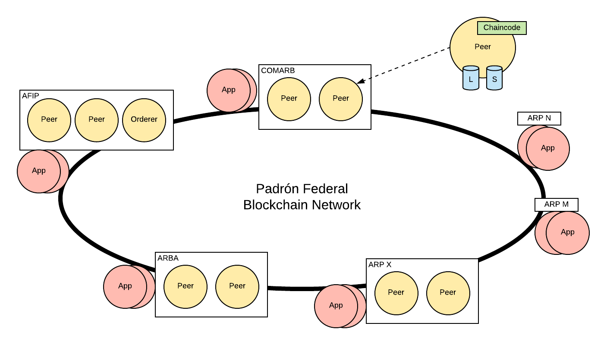
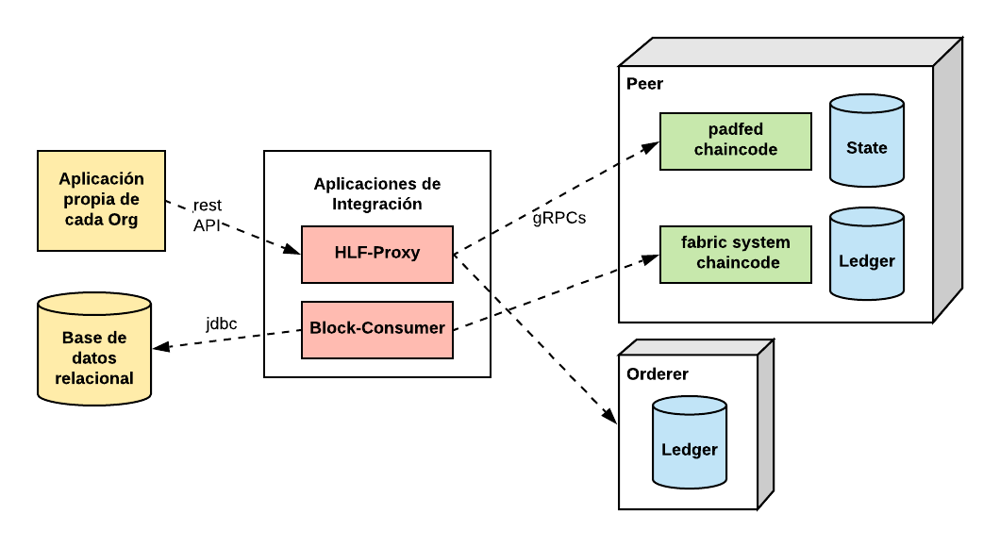

# PADFED docs

Documentación del proyecto de Blockchain del Padrón Federal.

[Presentación del Proyecto](https://github.com/padfed/padfed-doc/tree/master/'Blockchain Padrón Federal'.pdf)

---

[Visión General](https://github.com/padfed/padfed-doc/tree/master/overview)

---

[Modelo de Datos](https://github.com/padfed/padfed-doc/tree/master/model)

---

[Testnet](https://github.com/padfed/padfed-doc/tree/master/testnet-network-setup)

---

[Chaincode](https://github.com/padfed/padfed-doc/tree/master/chaincode)

---

## Aplicaciones de Integración:

- [HLF-Proxy](applications/hlf-proxy/README.md)

- [Block-Consumer](applications/block-consumer/README.md)

