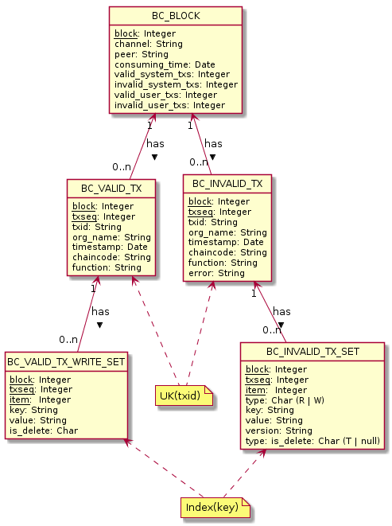

# Block-Consumer

Aplicación que consume bloques desde un channel de una red de Blockchain [Hyperledger Fabric 1.4](https://hyperledger-fabric.readthedocs.io/en/release-1.4/index.html), procesa su contenido y lo persiste en una base de datos relacional Oracle o PostgreSQL. 

Los bloques son consumidos en orden ascendente desde el bloque 0(cero) o Genesis Block hasta el bloque mas reciente. 

Una organización, autorizada a acceder a la Blockchain que no corre nodos de la red, puede conectar el Block-Consumer mediante internet a cualquier peer de la red. 


Una organización que corre nodos de la Blockchain, puede conectar el Block-Consumer a sus peers locales para lograr mejor performance de procesamiento. 


---

## Requisitos para la instalación

1. Equipo con 2 GB de RAM
1. DOCKER 18.09 o superior
1. DOCKER-COMPOSE 1.23.1 o superior
1. [Archivos de configuración](conf/README.md) 
1. Instancia de base de datos Oracle, PostgreSQL o SQL Server (:soon:) 

## Como ejecutarlo

#### Opción 1 - Ejecución mediante docker run

``` sh
docker run --rm --name block-consumer -d -v ${PWD}/conf:/conf -e TZ=America/Argentina/Buenos_Aires --tmpfs /tmp:exec -p 8084:8084 -d padfed/block-consumer:latest
```
#### Opción 2 - Ejecución mediante docker-compose up


``` sh

version: "2"


services:
  block-consumer:
    image: padfed/block-consumer:latest
    container_name: block-consumer
#    environment:
#      TZ=America/Argentina/Buenos_Aires
#    read_only: true
#   tmpfs: /tmp:exec
    working_dir: /
    volumes:
      - "./conf:/conf"
    ports:
      - "8084:8084"
    mem_limit: 512m
    depends_on:
      - oracle
#     - postgres

  oracle:
    image: sath89/oracle-xe-11g
    container_name: block-consumer-oracle
    ports:
      - "1521:1521"
    volumes:
      - /my/oracle/data:/u01/app/oracle sath89/oracle-xe-11g

#  postgres:
#    image: postgres
#    container_name: block-consumer-postgres
#    ports:
#    - "5433:5432"
#    volumes:
#    - ../src/main/sql-postgresql/inc:/scripts


# Logging overwrite
#    logging:
#      driver: "json-file"
#      options:
#        max-size: "100m"
#        max-file: "10"
```

---
## Base de Datos

### Modelo de Datos



TABLE | Descripción | PRIMARY KEY | INDEX
--- | --- | --- | ---
`BC_BLOCK` | Bloque consumido. | `BLOCK`
`BC_VALID_TX` | Transacción válida contenida en un bloque consumido. | `BLOCK, TXSEQ` | `TXID`
`BC_VALID_TX_WRITE_SET` | Ítem del WRITE_SET de transacciones válidas. Cada ítem corresponde a la creación o actualización de un registro del Padrón Federal en la Blockchain. Una actualización puede corresponder a la eliminación del registro (`IS_DELETE='T'`). | `BLOCK, TXSEQ, ITEM` | `KEY`
`BC_INVALID_TX` | Transacción inválida contenida en un bloque consumido. | `BLOCK, TXSEQ` | `TXID`
`BC_INVALID_TX_SET` | Ítem del READ_SET o WRITE_SET de transacciones inválidas. | `BLOCK, TXSEQ, TYPE, ITEM` | `KEY`

Usuario | Desc
--- | --- 
??? | Admin de la instancia.
`HLF` | Dueño del schema.
`BC_APP` | Usuario que utiliza la aplicación para conectarse a la base de datos. Debe tener permisos para ejecutar la package `HLF.BC_PKG`.
`BC_ROSI` | (Opcional) Usuario para el datasource de la app ROSi. Tiene permisos para leer todas las tablas de `HLF`.

### Creación del Esquema HLF y de los usuarios de base de datos

Para crear el esquema `HLF` y se pueden ejecutar los scripts correspondientes a Oracle (`sql-oracle`) o a Postgres (`sql-postgresql`).

Script | Tipo | Descripción
--- | --- | ---
`inc/001_dcl_create_user_hlf.sql` | dcl | crea el usuario dueño del schema `HLF`
`inc/002_ddl_create_schema_hlf.sql` | ddl | crea tablas, índices y restricciones en el schema `HLF`
`inc/003_ddl_create_pkg.sql` | ddl | invoca al script `../rep/bc_pkg.sql` 
`inc/004_dcl_create_apps_user.sql` | dcl | crea usuarios `BC_APP` y (opcional) `ROSI_APP`
`rep/bc_pkg.sql` | ddl | create de la package `HLF.BC_PKG` que utiliza Block-Consumer leer y actualizar las tablas del schema `HLF`

NOTA: Para Postgres asegurarse de ejecutar `su - postgres` y a continuación los scripts antes mencionados. Otra forma es ejecutando el script automatizado `helpers\createdb-hlf.sh`.
    
### Queries sobre la base de datos que carga el Block-Consumer 

#### Queries de negocio

Si bien, Block-Consumer es una aplicación totalmente agnóstica al negocio (se puede utilizar para procesar bloques de cualquier Blockchain HLF), esta sección del doc contiene ejemplos de queries aplicables al modelo de datos del Padrón Federal. 

Las queries propuestas utilizan condiciones con `LIKE` (o `REGEXP_LIKE` o `REGEXP_REPLACE` cuando requieren mayor precisión) aplicadas sobre las `KEY` y/o los `VALUE` registrados en la tabla `HLF.BC_VALID_TX_WRITE_SET`.

#### Estructura de las keys

Para aplicar condiciones sobre `HLF.BC_VALID_TX_WRITE_SET.KEY` es importante entender el patrón con el que se construyen las key: 

    per:{persona-id}#{tag}[:{item-id}]

donde:

- {persona-id} es la CUIT, CUIL o CDI, clave que identifica a la persona, formato NUMBER(11) 
- {tag} identifica al tipo de componente, formato STRING(3) 
- {item-id} identifica al ítem dentro del tipo de componente, compuesto por valores de las propiedades que conforman la clave primaria del ítem separados por punto.

{tag} | entidad         | ejemplo
--- | ---               | ---
`per` | Persona           | `per:20123456780#per`
`act` | Actividades       | `per:20123456780#act:1.883-123456`
`imp` | Impuestos         | `per:20123456780#per:20`
`dom` | Domicilios        | `per:20123456780#per:1.1.1`
`dor` | DomiciliosRoles   | `per:20123456780#per:1.1.1.1`
`tel` | Telefonos         | `per:20123456780#per:1`
`jur` | Jurisdicciones    | `per:20123456780#per:900`
`ema` | Emails            | `per:20123456780#per:1`
`arc` | Archivos          | :soon:
`cat` | Categorias        | `per:20123456780#cat:20.12`
`eti` | Etiquetas         | `per:20123456780#eti:329`
`con` | Contribuciones    | `per:20123456780#con:5244.21`
`rel` | Relaciones        | `per:20123456780#rel:20077799975.3.15`
`cms` | CMSedes           | `per:20123456780#cms:3`
`wit` | Testigo (witness) | `per:20123456780#wit`

#### Versiones vigentes de las keys 

Para una misma key se guarda un registro cada vez que su value es modificado. 
Para recuperar la versión vigente de una key las queries utilizan la función analítica `MAX(block*100000+txseq) OVER(PARTITION BY key)` seleccionado el registro que tenga el mayor `block*100000+txseq`.

#### Keys eliminadas 

Las keys eliminadas quedan marcadas con `HLF.BC_VALID_TX_WRITE_SET.IS_DELETE='T'`. 
Las queries, una vez que recuperan la versión vigente de una key, verifican que no haya sido eliminada mediante la condición `IS_DELETE IS NULL`.

#### Ejemplos

``` sql
-- Estado actual completo de una persona
--
select *
from
(
select i.*,
ROW_NUMBER() OVER(PARTITION BY KEY ORDER BY block desc, txseq desc) AS persona_id_row_number
from hlf.bc_valid_tx_write_set i
where key like 'per:20000021629#%'
and   key not like '%#wit' -- descarta el testigo
) x
where persona_id_row_number = 1 and is_delete is null
order by length(key), key
```

Para obtener la historia de una key se puede joinear `HLF.BC_VALID_TX` y `HLF.BC_VALID_TX_WRITE_SET`.

``` sql
-- Historia de una key
--
select block, txseq, t.timestamp, i.key, i.value, i.is_delete
from hlf.bc_valid_tx_write_set i
left join hlf.bc_valid_tx t
using (block, txseq)
where i.key like 'per:20000021629#per'
order by block desc, txseq desc
```

``` sql
-- Cantidad de keys agrupadas por tag
--
select tag, 
sum(case is_delete when 'T' then 0 else 1 end) as count_no_deleted,
sum(case is_delete when 'T' then 1 else 0 end) as count_deleted
from 
(
select key,
substr(key, 17, 3) as tag,
ROW_NUMBER() OVER(PARTITION BY KEY ORDER BY block desc, txseq desc) AS persona_id_row_number,
is_delete
from hlf.bc_valid_tx_write_set
where key like 'per:___________#___%'
) x
where persona_id_row_number = 1
group by tag
order by tag
```

``` sql
-- Cantidad de personas
--
select count(*)
from
(
select key,
ROW_NUMBER() OVER(PARTITION BY KEY ORDER BY block desc, txseq desc) AS persona_id_row_number,
is_delete 
from hlf.bc_valid_tx_write_set
where key like 'per:___________#per'
) x
where persona_id_row_number = 1 and is_delete is null
```

``` sql
-- Impuestos: 
-- + cantidad de personas inscriptas en el impuesto
-- + cantidad de inscripciones en el impuestos
--
-- + para extraer la cuit/cuil desde la key: substr(key, 5, 11)
-- + para extrear el impuesto desde el value se utiliza una regexp 
--
select
impuesto, 
count(distinct substr(key, 5, 11)) as personas,
count(*) as personas_impuestos
from 
(
select key,
to_number(regexp_replace(value, '^(\{.{0,})("impuesto":)([0-9]{1,4})(,.{1,}|\})$', '\3')) as impuesto,
ROW_NUMBER() OVER(PARTITION BY KEY ORDER BY block desc, txseq desc) AS persona_id_row_number, is_delete 
from hlf.bc_valid_tx_write_set
where key like 'per:___________#imp:%'
) x
where persona_id_row_number = 1 and is_delete is null
group by impuesto
order by impuesto
```

Los componentes de tipo `domicilio` y `actividad` puede tener ítems nacionales (org 1) o jurisdiccionales (org entre 900 y 924). Para discriminar entre ítem nacionales o jurisdiccionales se introduce el id del org en el patrón del `LIKE`.

``` sql
-- Actividades nacionales (org 1)
--
select 
count(*)
from 
(
select key, 
ROW_NUMBER() OVER(PARTITION BY KEY ORDER BY block desc, txseq desc) AS persona_id_row_number, is_delete 
from hlf.bc_valid_tx_write_set
where key like 'per:___________#act:_.%'
or    key like 'per:___________#act:883-%' /* registros guardados en la testnet con versiones del chaincode anteriores a 0.5.x */   
) x
where persona_id_row_number = 1 and is_delete is null
```

``` sql
-- Domicilios jurisdiccionales (orgs entre 900 y 924)
--
select 
count(*)
from 
(
select key,  
ROW_NUMBER() OVER(PARTITION BY KEY ORDER BY block desc, txseq desc) AS persona_id_row_number, is_delete 
from hlf.bc_valid_tx_write_set
where key like 'per:___________#dom:9%'
) x
where persona_id_row_number = 1 and is_delete is null
```

``` sql
-- Domicilios jurisdiccionales informados por COMARB (org 900)
--
select 
count(*)
from 
(
select key,  
ROW_NUMBER() OVER(PARTITION BY KEY ORDER BY block desc, txseq desc) AS persona_id_row_number, is_delete 
from hlf.bc_valid_tx_write_set
where key like 'per:___________#dom:900.%'
) x
where persona_id_row_number = 1 and is_delete is null
```

``` sql
-- Domicilios agrupados por provincia
--
select 
provincia,
count(distinct persona) as personas,
count(*) as domicilios
from
(
select key, persona,
case provincia   
when '0'  then 'CABA'
when '1'  then 'BUENOS AIRES'
when '2'  then 'CATAMARCA'
when '3'  then 'CORDOBA'
when '4'  then 'CORRIENTES'
when '5'  then 'ENTRE RIOS'
when '6'  then 'JUJUY'
when '7'  then 'MENDOZA'
when '8'  then 'LA RIOJA'
when '9'  then 'SALTA'
when '10' then 'SAN JUAN'
when '11' then 'SAN LUIS'
when '13' then 'SANTIAGO DEL ESTERO'
when '12' then 'SANTA FE'
when '14' then 'TUCUMAN'
when '16' then 'CHACO'
when '17' then 'CHUBUT'
when '18' then 'FORMOSA'
when '19' then 'MISIONES'
when '20' then 'NEUQUEN'
when '21' then 'LA PAMPA'
when '22' then 'RIO NEGRO'
when '23' then 'SANTA CRUZ'
when '24' then 'TIERRA DEL FUEGO'
else '#sin provincia'
end as provincia
from
(
select key, 
substr(key, 5, 11) as persona,
regexp_replace(value, '^(\{.{0,})("provincia":)([0-9]{1,2})(,.{1,}|\})$', '\3') as provincia,
ROW_NUMBER() OVER(PARTITION BY KEY ORDER BY block desc, txseq desc) AS persona_id_row_number, is_delete
from hlf.bc_valid_tx_write_set
where key like 'per:___________#dom:%' 
) x
where persona_id_row_number = 1 and is_delete is null
) x2
group by provincia
order by personas desc
```

``` sql
-- Domicilios nacionales ubicados en Cordoba (provincia 3)
--
select 
count(*)
from 
(
select key,  
ROW_NUMBER() OVER(PARTITION BY KEY ORDER BY block desc, txseq desc) AS persona_id_row_number, 
is_delete
from hlf.bc_valid_tx_write_set
where key like 'per:___________#dom:_.%'
and   regexp_like(value, '^\{.{0,}"provincia":3(,.{1,}|\})$')
) x
where persona_id_row_number = 1 and is_delete is null
```

---

#### Queries para monitoreo

``` sql
-- Ultimos 50 bloques procesados
--
with max_block as 
(
select max(block) as mb from hlf.bc_block
) 
select *
from   hlf.bc_block, max_block
where  block between max_block.mb-50 and max_block.mb
order by block desc
```

``` sql
-- Txs de deploy de chaincode
--
select * from 
hlf.bc_valid_tx tx
where chaincode='lscc'
order by block desc, txseq desc
``` 

``` sql
-- Txs inválidas
--
select * from 
hlf.bc_invalid_tx tx
order by block desc, txseq desc
``` 

### Changelog
---

1.4.0
* Se permite definir un límite de memoria a la JVM utilizada dentro de la imagen docker. Se incluyen ejemplos de inicio
* Soporte de SQL Server para persistir modelo de datos. Se incorporan scripts de creación del modelo de datos para dicho motor
* Se reapunta endpoint para metricas de monitoreo desde el endpoint "/metrics" a "/blockconsumer/metrics"

1.3.1

* Conexiones jdbc: asegurar cierre de conexión cuando se producen errores en las invocaciones sql
* Fix error violates check constraint "check_valid_tx_value" en bloques que cotienen txs con deletes

1.3.0

* Script para resetear la base de datos Oracle sin necesidad de recrear los objetos
* Permite configurar tamaño máximo de bloque a consumir
* Entrypoint de monitoreo `/metrics` compatible con [Prometheus](https://prometheus.io/)
