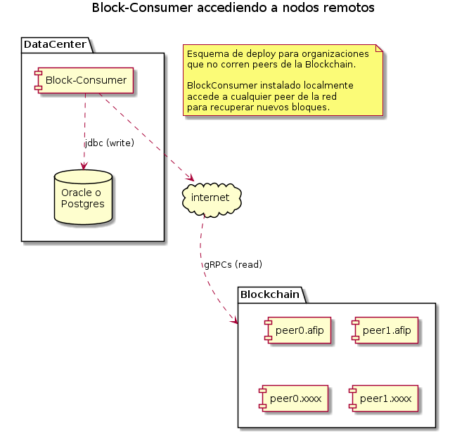
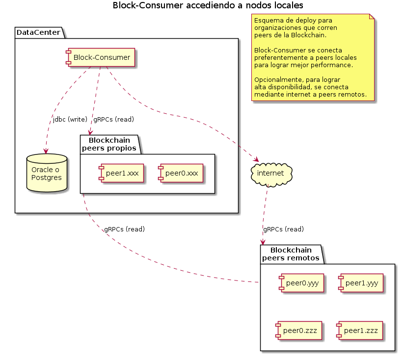

# Block-Consumer

Aplicación (imagen docker) que lee bloques desde un channel de una red de Blockchain [Hyperledger Fabric 1.4 LTS](https://hyperledger-fabric.readthedocs.io/en/release-1.4/index.html), procesa su contenido y lo persiste en una base de datos relacional Oracle, PostgreSQL o SQL Server.

Los bloques son leidos en orden ascendente desde el bloque 0(cero) o Genesis Block, hasta el bloque mas reciente.

Una organización, autorizada a acceder a la Blockchain que no corre nodos de la red, puede conectar el `block-Consumer` a cualquier peer de la red mediante internet.



Una organización que corre nodos de la Blockchain, puede conectar el `block-Consumer` a sus peers locales para lograr mejor performance de procesamiento.



---

## Requisitos

1. Equipo con 2 GB de RAM
1. `DOCKER 18.09` o superior
1. Reglas de proxy: acceso a por lo menos un peer de la red en internet, protocolo [gRPCs](https://grpc.io/) y puerto `7051`
1. Material criptográfico `x509` en formato `PEM`
1. Base de datos (`Oracle`, `PostgreSQL` o `SQL Server`): Espacio 100 GB

---

## Instrucciones de instalación

### 1) Material criptográfico propio del block-consumer

Son dos pares de clave-privada/certificado para:

- Servicio de Membresia [MSP](https://hyperledger-fabric.readthedocs.io/en/release-1.4/membership/membership.html)
- Seguridad en la capa de transporte [TLS](https://hyperledger-fabric.readthedocs.io/en/release-1.4/enable_tls.html)

Este material lo debe generar tu organización.

Los certificados deben estar emitidos por las CAs de tu organización, cuyos certificados deben estar registrados en la Blockchain.

Características del certificado para `MSP`:

- algoritmo: `prime256v1`
- en el `DN` debe contener `OU=<MSPID-de-tu-organizacion>` y `OU=client`.

Características del certificado para `TLS`:

- algoritmo: `RSA:2048`
- debe contener la extensión `Extended Key Usage TLS Web Client Authentication`.

Si para obtener este material criptográfico se utilizó `padfed-network-setup` los nombres de los archivos son los siguientes:

- `blockconsumer@blockchain-tributaria.xxx.gob.ar-msp-client.key`
- `blockconsumer@blockchain-tributaria.xxx.gob.ar-msp-client.crt`
- `blockconsumer@blockchain-tributaria.xxx.gob.ar-tls-client.key`
- `blockconsumer@blockchain-tributaria.xxx.gob.ar-tls-client.crt`

NOTA: podes asignarles nombres cualesquiera indicándolos en el `application.conf`.

### 2) Certificados de las CAs emisoras de certificados de `TLS` de los peers

Tenes que solicitarle a AFIP los certficados de las CAs que emitieron los certifcados de TLS de los peers a los cuales el `block-consumer` se va a conectar.

Ejemplo:

- `tlsica.blockchain-tributaria.afip.gob.ar-tls.crt`
- `tlsica.blockchain-tributaria.comarb.gob.ar-tls.crt`

### 3) application.conf

El `application.conf` contiene:

- parámetros de conexión a la base de datos
- ubicación del `client.yaml`
- ubicación del material criptográfico propio del `block-consumer`
- (opcional) filtros de keys

Ejemplo: [application.conf](application.conf)

### 4) client.yaml

El `client.yaml` es un archivo de configuración estándar de Fabric que describe la red.

Ejemplo: [client.yaml](client.yaml)

### 5) Estructura de directorios de deploy

En un equipo donde tengas instalado `docker` crea la siguiente estructura de directorios.

En `conf/crypto/client` ubicas el material criptográfico propio del `block-consumer`.

En `conf/crypto/tlscas` ubicas los certificados de las CAs emisoras de los certificados de `TLS` de los peers a los que `block-consumer` se va a conectar. Con la estructura de ejemplo, `block-consumer` se puede conectar a los peers de AFIP y de COMARB.

``` txt
block-consumer
  └── conf
      ├── application.conf
      ├── client.yaml
      └── crypto
          ├── client
          │   ├── blockconsumer@blockchain-tributaria.xxx.gob.ar-msp-client.key
          │   ├── blockconsumer@blockchain-tributaria.xxx.gob.ar-msp-client.crt
          │   ├── blockconsumer@blockchain-tributaria.xxx.gob.ar-tls-client.key
          │   └── blockconsumer@blockchain-tributaria.xxx.gob.ar-tls-client.crt
          └── tlscas
              ├── tlsica.blockchain-tributaria.afip.gob.ar-tls.crt
              └── tlsica.blockchain-tributaria.comarb.gob.ar-tls.crt
```

### 6) script para correr el contenedor

En el directorio `block-consumer` crea un script `docker-run.sh` con el siguiente contenido:

```sh
#!/bin/bash

docker run --log-opt max-size=10m \
           --log-opt max-file=10 \
           --rm \
           --name block-consumer \
           --tmpfs /tmp:exec \
           -v "${PWD}/conf:/conf" \
           -e TZ=America/Argentina/Buenos_Aires \
           -p 8084:8084 \
           -d padfed/block-consumer:2.0.0
```

### 7) Base de Datos

En una base de datos Oracle, PostgreSQL o SQL Server necesitas crear:

- un schema con tablas e índices
- una package o funciones intermediarias que son invocadas desde `block-consumer` para insertar filas
- un usuario de base de datos para que `block-consumer` pueda ejecutar la package o las funciones

Mas info: [base de datos](sql/relational-database.md)

---

## Funcionamiento de block-consumer

Cuando arranca invoca a la función de base de datos `block_height()` para obtener el máximo número de bloque registrado en la tabla `BC_BLOCK`.

A continuación se conecta a la Blockchain y comienza a leer secuencialmente los bloques desde el número obtenido con  `block_height()` + 1.

Por cada bloque leido:

- invoca a la función de base de datos `add_block()` para insertar una fila en `BC_BLOCK`
- por cada tx contenida en el bloque
  - invoca a la función `add_tx()` para insertar una fila en `BC_VALID_TX` con la info de la tx y otra en `BC_VALID_TX_WRITE_SET` con la info de la primera key actualizada por la tx
  - por cada key actualizada por la tx (exceptuando la primera)
    - invoca a la función `add_tx()` para insertar una fila en  `BC_VALID_TX_WRITE_SET`

En caso que la tx fue invalidada (no logró actualizar el state de la Blockchain) la info de la tx y de las keys que leyó y de las que intentó actualizar se registran respectivamente en `BC_INVALID_TX` y en `BC_INVALID_TX_SET`.

---

### Changelog

[changelog](CHANGELOG.md)
