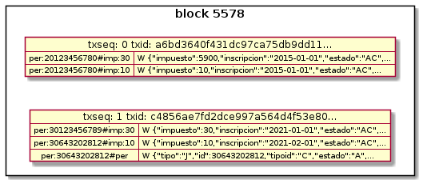

# block-consumer: base de datos relacional

* [Introducción](#introducción)
* [Diagrama de entidad y relaciones](#diagrama-de-entidades-y-relaciones)
* [Diccionario de datos](#diccionario-de-datos)
* [Funciones de base de datos mediadoras](#funciones-de-base-de-datos-mediadoras)
* [Queries de ejemplo](#queries-de-ejemplos)

## Introducción

El modelo de base de datos relacional de **block-consumer** representa el contenido de los bloques de una Blockchain Fabric:

* un bloque contiene un set de transacciones (txs)
* una tx contiene un [read_write_set](https://hyperledger-fabric.readthedocs.io/en/release-1.4/readwrite.html)



La información mas útil es el contenido del `write_set` de la txs válidas que se persiste en la tabla `BC_VALID_TX_WRITE_SET`. Desde esta tabla facilmente se puede recuperar el estado actual (state) y la historia de cambios aplicados sobre el valor de una key.

Los bloques Fabric pueden contener **txs inválidas** (quedaron registradas en el ledger pero no lograron actualizar el state). **block-consumer** separa su contenido y lo persiste en `BC_INVALID_TX` y `BC_INVALID_TX_SET` para facilitar el análisis del error que causó la invalidación. Su contenido no tiene validez para el negocio y se puede depurar periodicamente.

## Diagrama de entidades y relaciones


## Diccionario de datos

#### Table BC_BLOCK

COLUMN | DESC | NOT NULL | PK
--- | --- | --- | ---
`block` | Número de bloque. | X | X
`channel` | Nombre del channel. En Padrón Federal es siempre `padfedchannel`. | X |
`peer` | Nombre del peer desde donde `block-consumer` obtuvo el bloque. | X |
`timestamp` | Timestamp de la primera tx del bloque. | X.
`consuming_time` | Fecha y hora en que el bloque fue procesado por `block-consumer` | X
`valid_system_txs` | Cantidad de txs de config de la blockchain válidas. Ejemplos: creación del channel, join de un peer. |
`invalid_system_txs` | Cantidad de txs de config de la blockchain inválidas. |
`valid_user_txs` | Cantidad de txs de negocio válidas (efectuadas mediante el smart contract o chaincode). |
`invalid_user_txs` | Cantidad de txs de negocio inválidas. |

#### Table BC_VALID_TX

COLUMN | DESC | NOT NULL | PK | UK
--- | --- | --- | --- | ---
`block` | Número de bloque. | X | X
`txseq` | Número secuencial de la tx dentro del bloque, comenzando dede 0(cero). | X | X
`txid` | UUID de la tx. |  | | X
`org_name` | MSPID del cliente que firmó la tx. Hasta ahora en Padrón Federal es siempre `AFIP`. | X |
`timestamp` | Timestamp de la tx. | X |
`chaincode` | Chaincode que procesó la tx. | X
`function` | Function (del chaincode) que procesó la tx y completó su read_write_set. | X
`excluded_write_keys` | Cantidad de keys excluidas por `block-consumer` (no guardadas en `BC_VALID_TX_WRITE_SET`, debido a que matchearon contra alguna de las regexps de exclusión configuradas por el usuario. |

#### Table BC_VALID_TX_WRITE_SET

En esta tabla se guarda el contenido del `write_set`de las txs válidas. El `read_set` (versiones de keys leídas por el chaincode) no se persiste en la base de datos. Con lo cual el contenido de la tabla siempre corresponde a actualizaciones. Dada una key el registro con mayor número de bloque corresponde al de su estado actual (última version).

COLUMN | DESC | NOT NULL | PK | INDEX
--- | --- | --- | --- | ---
`block` | Número de bloque. | X | X
`txseq` | Número secuencial de la tx dentro del bloque. | X | X
`item` | Número secuencial del ítem del write_set dentro de la tx. | X | X
`key` | Key actualizada por la tx. | X | | X
`value` | Valor de la key actualizada por la tx. Por lo general el valor es un json.|  |
`big_value` | Valor CLOB de la key actualizada. No es necesario en Padrón Federal. |  |
`is_delete` | `T` o null. `T` indica que la tx eliminó la key en el state. |  |

---

## Funciones de base de datos mediadoras

`block-consumer` en vez de impactar directamente sobre el modelo de datos invoca a funciones intermediarias creadas en la base de datos.

Esta estrategia de diseño permite que el usuario de `block-consumer`, modificando estas funciones, pueda alterar el modelo de datos, si lo considera conveniente.

FUNCTION | DESC
--- | ---
`block_height` | Invocada en el arranque para obtener el máximo número de bloque registrado en la base.
`add_block` | Invocada una vez por cada bloque para guardar la info de cabecera del bloque.
`add_tx` | Invocada por lo menos una vez por cada tx para guardar la info de cabecera del bloque y una vez por cada ítem del read_write_set que se persiste.
`add_tx_big_value` | (opcional) invocada como alternativa a `add_tx` si el usuario configura `block-consumer` indicando que requiere persitir values mayores a 4 KB (no necesario en Padrón Federal).
`verify` | (opcional) invocada antes de commitear el contenido completo del bloque. Permite verificar la integridad de la info que se intenta registrar en la base de datos. Uso recomendado unicamente en ambientes de desarrollo/homologación.

---

### Queries de ejemplos

#### Queries de negocio

Si bien `block-consumer` es una aplicación agnóstica al negocio (se puede utilizar para procesar bloques de cualquier Blockchain Fabric), esta sección contiene ejemplos de queries aplicables al modelo de datos del Padrón Federal.

La estructura de las keys y los values del Padrón Federal está especificado en [Model](/model/README.md)

* [Query: Estado actual de una persona](#query-estado-actual-de-una-persona)
* [Query: Historia de una key](#query-historia-de-una-key)
* [Query: Cantidad de keys agrupadas por tag](#query-cantidad-de-keys-agrupadas-por-tag)
* [Query: Cantidad de personas](#query-cantidad-de-personas)
* [Query: Cantidad de contribuyentes inscriptos en CM agrupados por estado](#query-cantidad-de-contribuyentes-inscriptos-en-convenio-multilateral-agrupados-por-estado)

#### Query: Estado actual de una persona

``` sql
select *
from
(
select i.*,
MAX(BLOCK) OVER(PARTITION BY KEY) as MAX_BLOCK_OVER
from  bc_valid_tx_write_set i
where key like 'per:20000021629#%'
) x
where BLOCK = MAX_BLOCK_OVER
and   IS_DELETE is null
```

##### Versión vigente de cada key

Para una misma key se guarda un registro cada vez que su value es modificado. Un mismo bloque no puede contener mas de una modificacion sobre la misma key. Entonces para recuperar la versión vigente de cada key la query utiliza la función analítica `MAX(BLOCK) OVER(PARTITION BY KEY) AS MAX_BLOCK_OVER` y el filtro `BLOCK = MAX_BLOCK_OVER`.

##### Keys eliminadas

Las keys eliminadas quedan marcadas con `BC_VALID_TX_WRITE_SET.IS_DELETE='T'`.
El query, una vez que recupera la versión vigente cada key, verifican que no haya sido eliminada aplicando `IS_DELETE IS NULL`.

#### Query: Historia de una key

``` sql
select block, txseq, t.timestamp, i.key, i.value, i.is_delete
from bc_valid_tx_write_set i
left join bc_valid_tx t
using (block, txseq)
where i.key = 'per:20000021629#per'
order by block desc
```

Para obtener el timestamp de cada version de la key el query joinea `BC_VALID_TX` y `BC_VALID_TX_WRITE_SET`.

#### Query: Cantidad de keys agrupadas por tag

(FULL SCAN)

``` sql
select tag,
sum(case is_delete when 'T' then 0 else 1 end) as count_no_deleted,
sum(case is_delete when 'T' then 1 else 0 end) as count_deleted
from
(
select key,
substr(key, 17, 3) as tag,
MAX(BLOCK) OVER(PARTITION BY KEY) as MAX_BLOCK_OVER, BLOCK, IS_DELETE
from  bc_valid_tx_write_set
where key like 'per:___________#___%'
) x
where BLOCK = MAX_BLOCK_OVER
group by tag
order by tag
```

#### Query: Cantidad de personas

(FULL SCAN)

``` sql
select count(*)
from
(
select key,
MAX(BLOCK) OVER(PARTITION BY KEY) as MAX_BLOCK_OVER, BLOCK, IS_DELETE
from bc_valid_tx_write_set
where key like 'per:___________#wit'
) x
where BLOCK = MAX_BLOCK_OVER
and   is_delete is null
```

#### Query: Cantidad de contribuyentes inscriptos en Convenio Multilateral agrupados por estado

(FULL SCAN)

``` sql
select
estado,
count(distinct cuit) as casos
from
(
select
distinct substr(key, 5, 11) as cuit,
regexp_replace(value, '^{.*"estado":"([A-Z]{2})".*}', '\1') as estado,
MAX(BLOCK) OVER(PARTITION BY KEY) as MAX_BLOCK_OVER,
BLOCK,
IS_DELETE
from bc_valid_tx_write_set
where key like 'per:___________#imp:5900'
) x
where BLOCK = MAX_BLOCK_OVER
and   is_delete is null
group by estado
order by estado
```

### Queries para monitoreo

#### Query: Ultimos 100 bloques procesados

``` sql
with max_block as
(
select max(block) as max_block from bc_block
)
select *
from  bc_block, max_block
where block between max_block.max_block-100 and max_block.max_block
order by block desc
```

#### Query: Txs que actualizaron el chaincode

(FULL SCAN)

``` sql
select *
from  bc_valid_tx tx
where chaincode = 'lscc'
order by block desc
```

---

## Creación del Esquema HLF y de los usuarios de base de datos

Para crear el esquema `HLF` y se pueden ejecutar los scripts correspondientes a Oracle (`sql-oracle`) o a Postgres (`sql-postgresql`).

Script | Tipo | Descripción
--- | --- | ---
`inc/001_dcl_create_user_hlf.sql` | dcl | crea el usuario dueño del schema `HLF`
`inc/002_ddl_create_schema_hlf.sql` | ddl | crea tablas, índices y restricciones en el schema `HLF`
`inc/003_ddl_create_pkg.sql` | ddl | invoca al script `../rep/bc_pkg.sql`
`inc/004_dcl_create_apps_user.sql` | dcl | crea usuarios `BC_APP` y (opcional) `ROSI_APP`
`rep/bc_pkg.sql` | ddl | create de la package `HLF.BC_PKG` que utiliza Block-Consumer leer y actualizar las tablas del schema `HLF`

NOTA: Para Postgres asegurarse de ejecutar `su - postgres` y a continuación los scripts antes mencionados. Otra forma es ejecutando el script automatizado `helpers\createdb-hlf.sh`.
