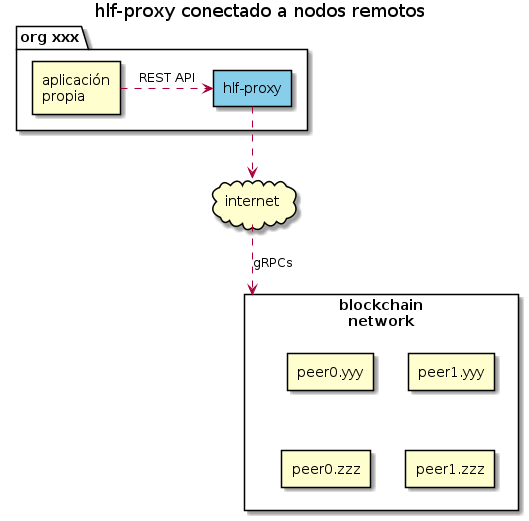
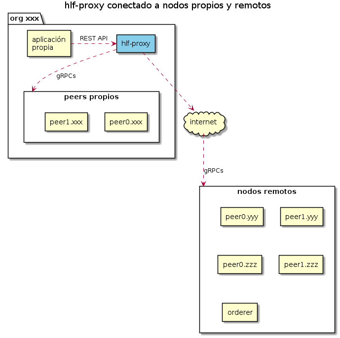

# hlf-proxy

Aplicación que expone una API REST que permite invocar las funciones de los chaincodes de aplicación (en PADFED usamos el chaincode `padfedcc`) y del Query System Chaincode [qscc](https://github.com/hyperledger/fabric/tree/master/core/scc/qscc) en una red de blockchain [Hyperledger Fabric 1.4](https://hyperledger-fabric.readthedocs.io/en/release-1.4/index.html).

El chaincode `padfedcc` ofrece funciones que permiten consultar el estado actual de una persona, la historia de de los assets que componen una persona, la lista de funciones disponibles, etc.

Por otro lado, el chaincode `qscc` ofrece funciones que permiten obtener información de la blockchain, el contenido de un bloque, el contenido de una transaccion.

**hlf-proxy** permite invocar las funciones de los chaincodes (ya sea `padfedcc`, `qscc` o cualquier otro) mediente el recurso `/query`.

AFIP tambien utiliza `padfedcc` para actualizar el estado de una persona mediante el recurso `/invoke`.

Adicionalmente, **hlf-proxy** ofrece el recurso `/ledgers` con endpoints que facilitan consultar el contenido de un bloque, el estado de transacciones y la cantidad de bloques que tiene un peer.

Ya sea mediante el endpoint `/query/{channel}/qscc` invocando a la function `GetBlockByNumber` o el endpoint `/ledger/blocks/{channel}/{blockNumner}`, se puede utilizar **hlf-proxy** para consumir bloque a bloque el contenido de la blockchain sustituyendo el uso de **hlf-block-consumer**.

**hlf-proxy** implementa una interfaz Swagger que atiende en `[FQDN]:[port configurado en application.conf]/swagger#/`

---

## Endpoints

Todas las urls comienzan con `/hlfproxy/api/v1` y contienen un parámetro `{channel}` para indicar el channel al que se accede (en PADFED el channel es `padfedchannel`).

metodo | enpoint | desc
---    | --- | ---
`POST` | `/query/{channel}/{cc}[/{peer}]`         | Invoca una function del chaincode `{cc}` en el peer `{peer}` o en los peers configurados en el deploy.
`POST` | `/invoke/{channel}/{cc}`                 | Invoca una function del chaincode `{cc}` y envia los respaldos obtenidos desde los peers al orderer.
`GET`  | `/ledger/blockheight/{channel}[/{peer}]` | Recupera el número de bloque mas alto desde el peer `{peer}` o desde alguno de los peers configurados en el deploy.
`GET`  | `/ledger/blocks/{channel}/{blockNumber}` | Recupera el contenido del bloque `{blockNumber}`.
`GET`  | `/ledger/transactions/{channel}/{txId}`  | Recupera el estado de la transacción `{txId}`.
`POST` | `/ledger/transactions/{channel}`         | Recupera el estado de las transacciones cuyos ids se informan en el body.

---

### Recurso `/query`

Se utiliza para obtener información desde la blockchain.

`POST` | `/query/{channel}/{cc}[/{peer}][?{verbose}]`
--- | :---

Invoca una function del chaincode `{cc}` en el peer `{peer}` o en los peers configurados en el deploy.

El query string `verbose=true` agrega info adicional en la respuesta.

**request body:**

El nombre de la function del chaincode y sus argumentos se informan en el body en un objeto JSON con ítems:

ítem       | tipo   | desc
--------   | ---    | ---
`function` | string | Nombre de la function.
`args`     | array  | Argumentos que espera la funcion.

Ejemplos:

```json
{"function":"GetPersona","args":[20123456780]}
```

```json
{"function":"GetVersion","args":[]}
```

```json
{"function":"queryPersona","args":[20123456780,true]}
```

**Ejemplo de request:**

```sh
curl -X POST "https:/domain/hlfproxy/api/v1/query/padfedchannel/padfedcc?verbose=true" -H "accept: application/json" -H "Content-Type: application/json" -d "{\"function\":\"queryPersona\",\"args\":[20123456780,true]}"
```

**response:**

Los endpoints responden con un objeto JSON con ítems:

item         | type    | desc
---          | ---     | ---
`txId`       | string  | id de la transacción generada por **hlf-proxy** para invocar al chaincode
`time`       | string  | fecha y horario en que se ejecutó la transacción en formato ISO 8601
`status`     | integer | http status code
`ccResponde` | string  | contenido de la respuesta del chaincode

En caso de falla (`status != 200`) o `?verbose=true` **hlf-prpoxy** agrega otros ítems que permiten obtener mas info sobre la ejecución de la transacción.

**ejemplo de response:**

http status code | 200
--- | ---

```json
{
  "txId": "a371c36a85fe494933c14d72bcf2ec9d6c87f12653c3a2fddbc8291b2b95e468",
  "time": "2021-06-09T15:52:37.361Z",
  "status": 200,
  "ccResponse": "[{\"Key\":\"per:20176058650#dom:1.1.1\",\"Record\":{\"orden\":1,\"org\":1,\"tipo\":1,\"estado\":2,\"calle\":\"XXXXXXX\",\"numero\":49,\"provincia\":1,\"localidad\":\"ACASSUSO\",\"cp\":\"1641\",\"nomenclador\":\"110\",\"ds\":\"2004-02-26\"}},{\"Key\":\"per:20176058650#dom:1.2.1\",\"Record\":{\"orden\":1,\"org\":1,\"tipo\":2,\"estado\":9,\"calle\":\"XXXXXXX\",\"numero\":50,\"provincia\":1,\"localidad\":\"ACASSUSO\",\"cp\":\"1641\",\"nomenclador\":\"110\",\"ds\":\"2014-07-03\"}},{\"Key\":\"per:20176058650#ema:1\",\"Record\":{\"direccion\":\"XXXXXXXXXXXXXX@XXXX.XXX.XX\",\"orden\":1,\"tipo\":8,\"ds\":\"2016-06-16\"}},{\"Key\":\"per:20176058650#ema:2\",\"Record\":{\"direccion\":\"XXXXXXXXXXXXXX@XXXX.XXX.XX\",\"orden\":2,\"tipo\":8,\"ds\":\"2016-06-16\"}},{\"Key\":\"per:20176058650#per\",\"Record\":{\"tipo\":\"F\",\"id\":20176058650,\"tipoid\":\"C\",\"estado\":\"A\",\"ds\":\"2013-01-29\",\"nombre\":\"XXXXX XXXXX\",\"apellido\":\"XXXXX\",\"sexo\":\"M\",\"documento\":{\"tipo\":96,\"numero\":\"XXXXXXXX\"},\"nacimiento\":\"1965-11-01\"}},{\"Key\":\"per:20176058650#tel:1\",\"Record\":{\"orden\":1,\"pais\":200,\"area\":11,\"numero\":99999999,\"tipo\":6,\"linea\":1,\"ds\":\"2013-12-16\"}},{\"Key\":\"per:20176058650#wit\",\"Record\":1}]"
}
```

---

### Recurso `/invoke`

Se utiliza para actualizar la información de la blockchain invocando a funciones de un chaincode de aplicación. En PADFED, AFIP utiliza este recurso para mantener actualizada la blockchain, invocando a la function `PutPersonaList` del chaincode `padfedcc`.

`POST` | `/invoke/{channel}/{cc}[?{verbose}&{waitForEventSeconds}]`
--- | :---

Invoca una function del chaincode `{cc}`, obtiene los respaldos desde los peer y los envia al orderer para que la transacción quede agregada en un nuevo bloque.

El query string `verbose=true` agrega info adicional en la respuesta.

El query string `waitForEventSeconds={integer}` indica la cantidad de segundos que **hlf-proxy** espera hasta que la transacción quede agregada en un nuevo bloque.

Al igual que los enpoints de `/query`, los de `/invoke` requieren un body con un objeto JSON con ítems `function` y `args`.

**response:**

Los endpoints responden con un objeto JSON con ítems:

item         | type    | desc
---          | ---     | ---
`txId`       | string  | id de la transacción generada por **hlf-proxy** para invocar al chaincode.
`time`       | string  | fecha y horario en que se ejecutó la transacción en formato ISO 8601.
`status`     | integer | http status code.
`block`      | integer | Bloque en que quedó agregada y validada exitosamente la transacción. Este ítem no se agrega en caso que se haya utilizado el query string `waitForEventSeconds=0`.

En caso de falla (`status != 200 y 202`) o `verbose=true` **hlf-prpoxy** agrega otros ítems que permiten obtener mas info sobre la ejecución de la transacción.

**http status code:**

Basado en [List of HTTP status codes](https://en.wikipedia.org/wiki/List_of_HTTP_status_codes)

code | nombre           | desc
---- | :---             | :---
200  | OK               | Transacción OK, actualizó el state.
202  | ACCEPTED         | Transacción respaldada por los peers y enviada al orderer.
400  | BAD REQUEST      | Error atribuible al cliente.
403  | FORBIDDEN        | Se invocó una function del chaincode para la cual el MSP de **hlf-proxy** no tiene privilegios.
404   | NOT FOUND       | El chaincode respondío con status 404 indicando que no existe el assets que se intentó recuperar.
409   | CONFLICT        | Transacción invalidada por los committers.
500   | INTERNAL ERROR  | Error interno del sistema.
501   | NOT IMPLEMENTED | El chaincode respondío con status 501 indicando que la function invocada no existe.
504   | TIMEOUT         | Timeout accediendo al orderer.

Para entender mas sobre los status OK, ACCEPTED y CONFLICT: [fabric-txflow](https://hyperledger-fabric.readthedocs.io/en/release-1.4/txflow.html)

---

### Recurso `/ledger/blocks`

Se utiliza para obtener información de un bloque.

`GET` | `/ledger/blocks/{channel}/{blockNumner}[?{onlyvalidtxs}]`
--- | :---

El query string `onlyvalidtxs=true` indica que unicamente se recupere información de las transacciones validas que fueron las que lograron actualizar el state.

**response:**

Los endpoints responden con un objeto JSON con ítems:

ítem               | tipo    | desc
---                | ---     | ---
`block`            | integer | Número de bloque.
`channel`          | string  | Nombre del channel.
`timestamp`        | integer | Timestamp del bloque.
`validSystemTxs`   | integer | Cantidad de transacciones de gestion del sistema válidas.
`invalidSystemTxs` | integer | Cantidad de transacciones de gestion del sistema invalidas.
`validUserTxs`     | integer | Cantidad de transacciones de aplicación validas.
`invalidUserTxs`   | integer | Cantidad de transacciones de aplicación invalidas.
`transactions`     | array   | Transacciones incluidas en la blockchain.

**ítems de transaction:**

ítem               | tipo    | desc
---                | ---     | ---
`id`               | string  | id de la transacción.
`txSeq`            | integer | Número de secuencial de la transacción dentro del bloque, desde 1(uno).
`valid`            | boolean | `true`: transacción válida, actualizó el state.
`function`         | string  | Function invocada.
`chaincode`        | string  | Chaincode invocado.
`readSet`          | objecto | Set de `{key}:{version}` leídas.
`writeSet`         | objecto | Set de `{key}:{value}` actualizadas.
`deleteSet`        | array   | Array de `{key}` eliminadas.

Si el bloque no existe responde con http status code 404 NOT FOUND.

**ejemplo de response:**

http status code | 200
--- | ---

```json
{
  "block": 1000,
  "channel": "padfedchannel",
  "timestamp": "2020-06-30T17:23:57.430Z",
  "validSystemTxs": 0,
  "invalidSystemTxs": 0,
  "validUserTxs": 2,
  "invalidUserTxs": 0,
  "transactions": [
    {
      "txSeq": 1,
      "valid": true,
      "timestamp": "2020-06-30T17:23:41.330Z",
      "function": "PutPersonaList",
      "id": "e37ed6f177e05ce64aa1a78ea294912805b7c4db47d0b370691ecb600c9379ed",
      "chaincode": "padfedcc",
      "readSet": {
        "per:20123456780#wit": "1:0",
        "per:20121212120#wit": "1:0"
      },
      "writeSet": {
        "per:20123456780#imp:5900": "{\"impuesto\":5900,\"inscripcion\":\"2020-08-01\",\"estado\":\"AC\",\"dia\":1,\"periodo\":202008,\"motivo\":{\"id\":551},\"ds\":\"2021-05-19\"}",
        "per:20121212120#jur:1.0": "{\"provincia\":0,\"desde\":\"2021-04-01\",\"org\":1,\"ds\":\"2021-06-08\"}"
      },
      "deleteSet": []
    },
    {
      "txSeq": 2,
      "valid": true,
      "timestamp": "2020-06-30T17:23:57.430Z",
      "function": "PutPersonaList",
      "id": "153685886318f3224fe620213146dd110d3fb8f3c7a8ba54514910e6963adb60",
      "chaincode": "padfedcc",
      "readSet": {
        "per:20171234560#wit": "1:0"
      },
      "writeSet": {
        "per:20171234560#ema:1": "{\"direccion\":\"pepe@gmail.com\",\"orden\":1,\"tipo\":8,\"ds\":\"2016-06-16\"}"
      },
      "deleteSet": ["per:20171234560#ema:2", "per:20171234560#ema:3"]
    }
  ]
}
```

### Recurso `/ledger/transactions`

Se utiliza para obtener información del estado de una o mas transacciones.

`GET` | `/ledger/transactions/{channel}/{txId}`
--- | :---

**response:**

Los endpoints de `/ledger/transactions` responden con un objeto JSON con ítems:

ítem    | tipo    | desc
---     | ---     | ---
`txId`  | string  | Id de la transacción.
`valid` | boolean | `true`: transacción válida, actualizó el state.

Si la transacción no existe responde con http status code 404 NOT FOUND.

**ejemplo de response:**

http status code | 200
--- | ---

```json
{
  "txId": "e37ed6f177e05ce64aa1a78ea294912805b7c4db47d0b370691ecb600c9379ed",
  "valid": true
}
```

`POST` | `/ledger/transactions/{channel}`
---    | :---

Requieren que el body del request tenga un array JSON con los ids de las transacciones.

**response:**

Responden con un objeto JSON con ítems:

777777777777777777777777777777777777777777777777777777777777

ítem               | tipo    | desc
---                | ---     | ---
`block`            | integer | Número de bloque.
`channel`          | string  | Nombre del channel.
`timestamp`        | integer | Timestamp del bloque.
`validSystemTxs`   | integer | Cantidad de transacciones de gestion del sistema válidas.
`invalidSystemTxs` | integer | Cantidad de transacciones de gestion del sistema invalidas.
`validUserTxs`     | integer | Cantidad de transacciones de aplicación validas.
`invalidUserTxs`   | integer | Cantidad de transacciones de aplicación invalidas.
`transactions`     | array   | Transacciones incluidas en la blockchain.

**ítems de transaction:**

ítem               | tipo    | desc
---                | ---     | ---
`id`               | string  | id de la transacción.
`txSeq`            | integer | Número de secuencial de la transacción dentro del bloque, desde 1(uno).
`valid`            | boolean | `true`: transacción válida, actualizó el state.
`function`         | string  | Function invocada.
`chaincode`        | string  | Chaincode invocado.
`readSet`          | objecto | Set de `{key}:{version}` leídas.
`writeSet`         | objecto | Set de `{key}:{value}` actualizadas.
`deleteSet`        | array   | Array de `{key}` eliminadas.

**ejemplo de response:**

http status code | 200
--- | ---

```json
{
  "block": 1000,
  "channel": "padfedchannel",
  "timestamp": "2020-06-30T17:23:57.430Z",
  "validSystemTxs": 0,
  "invalidSystemTxs": 0,
  "validUserTxs": 2,
  "invalidUserTxs": 0,
  "transactions": [
    {
      "txSeq": 1,
      "valid": true,
      "timestamp": "2020-06-30T17:23:41.330Z",
      "function": "PutPersonaList",
      "id": "e37ed6f177e05ce64aa1a78ea294912805b7c4db47d0b370691ecb600c9379ed",
      "chaincode": "padfedcc",
      "readSet": {
        "per:20123456780#wit": "1:0",
        "per:20121212120#wit": "1:0"
      },
      "writeSet": {
        "per:20123456780#imp:5900": "{\"impuesto\":5900,\"inscripcion\":\"2020-08-01\",\"estado\":\"AC\",\"dia\":1,\"periodo\":202008,\"motivo\":{\"id\":551},\"ds\":\"2021-05-19\"}",
        "per:20121212120#jur:1.0": "{\"provincia\":0,\"desde\":\"2021-04-01\",\"org\":1,\"ds\":\"2021-06-08\"}"
      },
      "deleteSet": []
    },
    {
      "txSeq": 2,
      "valid": true,
      "timestamp": "2020-06-30T17:23:57.430Z",
      "function": "PutPersonaList",
      "id": "153685886318f3224fe620213146dd110d3fb8f3c7a8ba54514910e6963adb60",
      "chaincode": "padfedcc",
      "readSet": {
        "per:20171234560#wit": "1:0"
      },
      "writeSet": {
        "per:20171234560#ema:1": "{\"direccion\":\"pepe@gmail.com\",\"orden\":1,\"tipo\":8,\"ds\":\"2016-06-16\"}"
      },
      "deleteSet": ["per:20171234560#ema:2", "per:20171234560#ema:3"]
    }
  ]
}
```

---

## Deploy

Una organización autorizada a acceder a la Blockchain que no corre nodos de la red, puede utilizar **hlf-proxy** conectóndolo mediante internet a cualquier nodo de la red.



Una organización que corre nodos de la Blockchain, puede utilizar **hlf-proxy** conectándolo a sus propios peers para tener mejor tiempo de respuesta y a cualquier otro nodo de la red para tener alta disponibilidad.



Para la actualizar la Blockchain **hlf-proxy** requiere una conexion con el orderer.

## Como correr la aplicación

**hlf-proxy** esta disponible como imgen docker.

Para correr la aplicacion se requiere que el equipo tenga instalado:

- DOCKER 18.09 o superior

- DOCKER-COMPOSE 1.23.1 o superior (opcional)

```sh
docker pull padfed/hlf-proxy:1.7.0
```

### Opción 1 - Ejecución mediante docker run

``` sh
 docker run \
 --log-driver json-file \
 --log-opt max-size=100m \
 --log-opt max-file=10 \
 -m 512m \
 --rm \
 --name hlf-proxy \
 --tmpfs /tmp:exec \
 -v ${PWD}/conf:/conf \
 -p 8085:8085 \
 -d \
 padfed/hlf-proxy:1.7.0

```

### Opción 2 - Ejecución mediante docker-compose up

Archivo `docker-comnpose.yaml`:

``` sh
version: "2"

services:
  hlf-proxy:
    labels:
      app: hlf-proxy
    container_name: hlf-proxy
    image: padfed/hlf-proxy:1.7.0
    read_only: true
    environment:
      - TZ=America/Argentina/Buenos_Aires
    mem_limit: 512m
    ports:
      - 8085:8085
    tmpfs: /tmp:exec
    volumes:
      - "./conf:/conf"

Logging overwrite
   logging:
     driver: "json-file"
     options:
       max-size: "100m"
       max-file: "10"
```

    $ docker-compose up

## Requerimientos de networking

Acceso por protocolo gRPC sobre TLS a los nodos peers y orderer configurados en xxx.client.yaml:

## Archivos requeridos

| Archivo                          | Descripción                                                                                                                    | Ubicación                     |
| -------------------------------- | ------------------------------------------------------------------------------------------------------------------------------ | ----------------------------- |
| application.conf                 | Archivo de configuración de la aplicación                                                                                      | ${PWD}/conf/                  |
| xxx.client.yaml                  | Archivo que describe la red                                                                                                    | Indicada en application.conf. |
| hlfproxy@{DOMAIN}-msp-client.key | Clave privada para MSP de la aplicaciòn                                                                                        | Indicada en application.conf. |
| hlfproxy@{DOMAIN}-msp-client.crt | Certificado para MSP de la aplicaciòn                                                                                          | Indicada en application.conf. |
| hlfproxy@{DOMAIN}-tls-client.key | Clave privada para TLS de la aplicaciòn                                                                                        | Indicada en application.conf. |
| hlfproxy@{DOMAIN}-tls-client.crt | Certificado para TLS de la aplicaciòn                                                                                          | Indicada en application.conf.    |
| \*-tls.crt                       | Certificados de las CAs raíces o intermedias para TLS de las organizaciones que corren nodos a los cuales se requiere acceder | Indicadas en xxx.client.yaml. |

### application.conf

``` txt
# Puerto
application.port=8085

# Habilita/deshabilita invocacion a endpoint "/invoke/{channel}/{cc}"
endpoint.invoke.enabled=true

# Regexp para restringir acceso a funciones especificas del CC invocado
endpoint.invoke.function.list.enabled=".*"

# FABRIC conf
fabric.waitForEventSeconds=5
fabric.yaml.conf=./conf/blockchain-tributaria.client.yaml

fabric.auth.type=fs
fabric.auth.appuser.name=hlfproxy
certificate.check.restrict=false
fabric.auth.appuser.keystore.path=/conf/crypto/client/blockconsumer@{DOMAIN}-msp-client.key
fabric.auth.appuser.certsign.path=/conf/crypto/client/blockconsumer@{DOMAIN}-msp-client.crt
fabric.tls.auth.appuser.keystore.path=/conf/crypto/client/blockconsumer@{DOMAIN}-tls-client.key
fabric.tls.auth.appuser.certsign.path=/conf/crypto/client/blockconsumer@{DOMAIN}-tls-client.crt

netty {
  #server.threads.Max default --> Math.max(32, availableProcessors * 8)
  #overwrite like system property --> -Dserver.threads.Max
  workerThreads = ${server.threads.Max}

  http {
    #overwrite max body size (413 Request Entity Too Large)
    MaxContentLength = ${server.http.MaxRequestSize}
  }
}

server {
  business.thread.timeout.seconds=10
}

fabric {
  netty {
    grpc {
      //keyAliveTime in Minutes
      NettyChannelBuilderOption.keepAliveTime="5"
      //keepAliveTimeout in Seconds
      NettyChannelBuilderOption.keepAliveTimeout="8"
      NettyChannelBuilderOption.keepAliveWithoutCalls="true"
      //maxInboundMessageSize in bytes
      NettyChannelBuilderOption.maxInboundMessageSize="10748894"
    }
  }

  sdk {
    peer.retry_wait_time = "5000"
  }
}

swagger {
  schemes: ["http","https"]
}
```

### xxx.client.yaml

En este ejemplo el proxy queda configurado para

- enviar las txs tipo invoke a todos los PEERs declarados (`endorsingPeer: true`)

- enviar las txs tipo query solamente al peer0 de XXX (`chaincodeQuery: true`)

- recuperar los eventos de validación de txs desde el peer0 de XXX (`eventSource: true`)

- recuperar info del ledger desde el peer0 de XXX (`ledgerQuery: true`)

``` yaml
name: "Network"
version: "1.0"
x-loggingLevel: trace

client:
  # organization: XXX | YYY| ZZZ
  organization: XXX
  logging:
    level: info
  eventService:
    timeout:
      connection: 5s
      registrationResponse: 5s

channels:
  padfedchannel:
    orderers:
      - orderer0.xxx.com

    peers:
      peer0.xxx.com:
        endorsingPeer: true
        chaincodeQuery: true
        ledgerQuery: true
        eventSource: true

      peer1.xxx.com:
        endorsingPeer: true
        chaincodeQuery: false
        ledgerQuery: false
        eventSource: false

      peer0.yyy.com:
        endorsingPeer: true
        chaincodeQuery: false
        ledgerQuery: false
        eventSource: false

      peer1.yyy.com:
        endorsingPeer: true
        chaincodeQuery: false
        ledgerQuery: false
        eventSource: false

      peer0.zzz.com:
        endorsingPeer: true
        chaincodeQuery: false
        ledgerQuery: false
        eventSource: false

      peer1.zzz.com:
        endorsingPeer: true
        chaincodeQuery: false
        ledgerQuery: false
        eventSource: false

organizations:
  XXX:
    mspid: XXX
    peers:
      - peer0.xxx.com
      - peer1.xxx.com

  YYY:
    mspid: YYY
    peers:
      - peer0.yyy.com
      - peer1.yyy.com

  ZZZ:
    mspid: ZZZ
    peers:
      - peer0.zzz.com
      - peer1.zzz.com

orderers:
  orderer0.xxx.com:
    url: grpcs://orderer0.xxx.com:7050
    tlsCACerts:
      path: conf/crypto/tlscas/xxx-tls.crt

peers:
  peer0.xxx.com:
    url: grpcs://peer0.xxx.com:7051
    tlsCACerts:
      path: conf/crypto/tlscas/xxx-tls.crt

  peer1.xxx.com:
    url: grpcs://peer0.xxx.com:7051
    tlsCACerts:
      path: conf/crypto/tlscas/xxx-tls.crt

  peer0.yyy.com:
    url: grpcs://peer0.yyy.com:7051
    tlsCACerts:
      path: conf/crypto/tlscas/yyy-tls.crt

  peer1.yyy.com:
    url: grpcs://peer0.yyy.com:7051
    tlsCACerts:
      path: conf/crypto/tlscas/yyy-tls.crt

  peer0.zzz.com:
    url: grpcs://peer0.zzz.com:7051
    tlsCACerts:
      path: conf/crypto/tlscas/zzz-tls.crt

  peer1.zzz.com:
    url: grpcs://peer0.zzz.com:7051
    tlsCACerts:
      path: conf/crypto/tlscas/zzz-tls.crt

```

### Changelog

1.4.4

- Se incluye nueva propiedad `MaxContentLength` en la configuración para facilitar ajustar el tamaño máximo de un request (413 Request Entity Too Large)

- Mejora de inicialización para evitar error NPE en escenarios de falla de conexión a los Peers en el arranque de la aplicación

- Soporta recibir `function` o `Function` como así también `args` o `Args` en el json del request body

1.4.3

- Se cambia comportamiento para el uso del endpoint `/invoke/{channel}/{cc}` que por default pasa a quedar inhabilitado.

- Se incluyen 2 nuevas propiedades de configuración para habilitar/deshabilitar endpoint `/invoke/{channel}/{cc}`

- Se reapunta endpoint para metricas de monitoreo desde el endpoint `/metrics` a `/hlfproxy/metrics`

1.4.2

- Se permite definir un límite de memoria a la JVM utilizada dentro de la imagen docker. Se incluyen ejemplos de inicio

1.4.1

- Fix: NPE invocando funciones que responden sin message
- Fix: NPE reciviendo un error desde el chaincode cuando el request esta en modo verbose

1.4.0

- Entrypoint de monitoreo `/metrics` compatible con [`Prometheus`](https://prometheus.io/)
