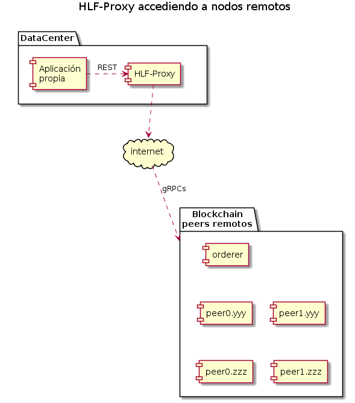
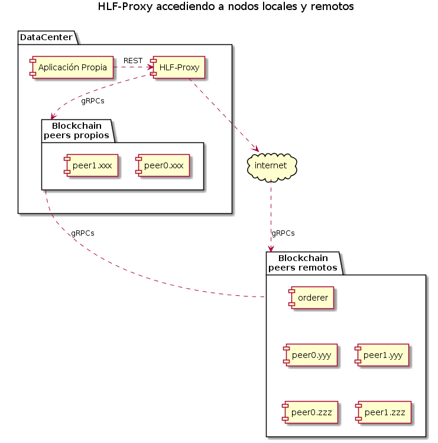

# hlf-proxy

Aplicación que expone una API REST que permite invocar las funciones de los chaincodes de apliación (ejemplo `padfedcc`) y del Query System Chaincode [QSCC](https://github.com/hyperledger/fabric/tree/master/core/scc/qscc) en una red de blockchain [Hyperledger Fabric 1.4](https://hyperledger-fabric.readthedocs.io/en/release-1.4/index.html).

Provee una Swagger UI que atiende en `[FQDN]:[port configurado en application.conf]/swagger#/`

## Esquemas de deploy

Una organización autorizada a acceder a la Blockchain que no corre nodos de la red, puede utilizar HLF-Proxy para invocar via REST las funciones del chaincode. HLF-Proxy se conecta mediante internet a los nodos de la red.



Una organización que corre nodos de la Blockchain, puede utilizar un HLF-Proxy conectado a sus propios peers para tener mejor tiempo de respuesta en consultas.

Para la actualizar la Blockchain requiere que HLF-Proxy este conectado mediante internet al orderer y a los peers remotos de otras organzasiones.



---

## Endpoints

| Endpoints                                                  | Método | Acción                                                                                                                                                                                        |
| ---------------------------------------------------------- | ------ | --------------------------------------------------------------------------------------------------------------------------------------------------------------------------------------------- |
| `/hlfproxy/api/v1/query/{channel}/{cc}[/{peer}][?{params}]`  | `POST`   | Invoca funciones del chaincode {cc} en el channel {channel} en el PEER {peer} o en los PEERs configurados en el **xxx.client.yaml** con `chaincodeQuery:true`. No envía la tx a los ORDERERs. |
| `/hlfproxy/api/v1/ledger/transactions/{channel}[?{params}]`  | `POST`   | Consulta el estado de una lista transacciones en el channel indicado en {channel}|
| `/hlfproxy/api/v1/invoke/{channel}/{cc}[?{params}]` | `POST`   | Invoca funciones del chaincode {cc} en el channel {channel} en los PEERs configurados en el **xxx.client.yaml** con `endorsingPeer:true`.  Envia la tx al ORDERERs.  (disponible solo para AFIP)     |
| `/hlfproxy/api/v1/ledger/blockheight/{channel}[/{peer}]`       | `GET`    | Recupera el número de bloque mas reciente o el mas alto desde el PEER {peer} o desde los PEERs configurados en el **xxx.client.yaml** con `ledgerQuery:true`.                                 |
|`/hlfproxy/api/v1/ledger/blocks/{channel}/{blockNumber}` |`GET`| Obtiene la información del bloque {blockNumber} en el canal indicado en {channel}|
|`/hlfproxy/api/v1/ledger/transactions/{channel}/{txId}` |`GET`| Consulta el estado de una transacción en el channel indicado en {channel}|

| Params                 | Endpoints      | Descripción                                                                                                                                                                                       | Default                                                                               |
| ---------------------- | -------------- | ------------------------------------------------------------------------------------------------------------------------------------------------------------------------------------------------- | ------------------------------------------------------------------------------------- |
| `waitForEventSeconds=n`  | invoke         | Tiempo en segundos que debe esperar por el evento de validación de la tx. Para que la espera funcione debe configurarse un único PEER en el archivo  **xxx.client.yaml**  con `eventSource:true`. | Valor configurado en el **application.conf** property ``fabric.waitForEventSeconds``. |
| `verbose=[true o false]` | query e invoke | true: agrega mas información en el json del response.                                                                                                                                             | false                                                                                 |

**ejemplo:**

```
http://dominio:8085/hlfproxy/api/v1/invoke/padfedchannel/padfedcc?waitForEventSeconds=100&verbose=true
```

### query e  invoke: Body del Request

**Content-type:** `application/json`

El body del request debe ser un json object con la siguientes estructura:

| Campo    | Descripción                                                        |
| -------- | ------------------------------------------------------------------ |
| `function` | Nombre de la función del chaincode.          |
| `args`     | Json array con los parámetros que recibe la función del chaincode. |

Ej: invoke a la function "getPersona" que recibe como argumento una cuit.

``` json
{"function":"getPersona","args":[20104249729]}
```

### HTTP Status Code

Basado en [List of HTTP status codes](https://en.wikipedia.org/wiki/List_of_HTTP_status_codes)

| Valor | Nombre                | Descripción                                                                                                                                                                                                                                                    |
| ----- | --------------------- | -------------------------------------------------------------------------------------------------------------------------------------------------------------------------------------------------------------------------------------------------------------- |
| 200   | OK (VALID)            | quey ok o tx invoke avalada por los Peers y validada por los Committers (actualizó el State).                                                                                                                                                                  |
| 202   | ACCEPTED              | Tx invoke avalada por los Peers y procesada por el Orderer. Se desconoce si fue validada por los Committers.                                                                                                                                                   |
| 400   | BAD REQUEST           | Error atribuible al cliente.                                                                                                                                                                                                                                   |
| 403   | FORBIDDEN             | El cliente intentó ejecutar una función del chaincode para la cual no tiene privilegios.                                                                                                                                                                       |
| 404   | NOT FOUND             | El cliente mediante una funcion get intentó obtener un registro inexistente.                                                                                                                                                                                   |
| 409   | CONFLICT              | Tx invoke avalada por los Peers pero posteriormente invalidada por los Committers. La tx fue agregada en un bloque pero quedó marcada como inválida. No actualizó el State. [Ver txflow](https://hyperledger-fabric.readthedocs.io/en/release-1.4/txflow.html) |
| 500   | INTERNAL SERVER ERROR | Error interno del sistema.                                                                                                                                                                                                                                     |
| 501   | NOT IMPLEMENTED       | El cliente invoco una función inexistente.                                                                                                                                                                                                                     |

### query e invoke: Response

**Content-type:** `application/json`

El body del response contiene un json object con la siguiente estructura:

(se considera SUCCESS cuando txStatus es VALID o ACCEPTED)

| Campo                 | SUCCESS verbose=false | SUCCESS verbose=true | ERROR | Desc                                                                                                                                                                                                                                                         |
| --------------------- | --------------------- | -------------------- | ----- | ------------------------------------------------------------------------------------------------------------------------------------------------------------------------------------------------------------------------------------------------------------ |
| status                | X                     | X                    | X     | [Ver HTTP Status Code]                                                                                                                                                                                                                                       |
| block                 | X                     | X                    | X     | Numero de bloque en que quedó incluida la tx. Solo se informa cuando el proxy espera por el evento de validación de la tx `waitForEventSeconds>0`                                                                                                            |
| txId                  | X                     | X                    | X     | id de la tx fabric                                                                                                                                                                                                                                           |
| time                  | X                     | X                    | X     | timestamp UTC en formato `yyyy-MM-dd HH:mm:ss`, ej: `2018-07-23 14:31:56`                                                                                                                                                                                    |
| channel               |                       | X                    | X     | Nombre del channel                                                                                                                                                                                                                                           |
| chaincode             |                       | X                    | X     | Nombre del chaincode                                                                                                                                                                                                                                         |
| txStatus              |                       | X                    | X     | [Ver Campo txStatus]                                                                                                                                                                                                                                         |
| step                  |                       |                      | X     | [Ver Campo step]                                                                                                                                                                                                                                             |
| errMsg                |                       |                      | X     | Mensaje de error generado en el step.                                                                                                                                                                                                                        |
| thread                |                       | X                    | X     | Nombre del thread que procesó la tx                                                                                                                                                                                                                          |
| client                |                       | X                    | X     | Integration api utilizada. Ej: `afip.bc.fabric.api`                                                                                                                                                                                                          |
| simulatingMs          |                       | X                    | X     | Milisegundos que demoró la simulación                                                                                                                                                                                                                        |
| ordererMs             |                       | X                    | X     | Milisegundos que demoró el envió a los ORDERERs. Solo se informa cuando el proxy no se queda esperado el evento de validación de la tx.                                                                                                                      |
| eventMs               |                       | X                    | X     | Milisegundos que demoró el envió a los ORDERERs + el evento de validación de la tx                                                                                                                                                                           |
| ccResponse            |                       | X                    | X     | [Ver Campo ccResponse]                                                                                                                                                                                                                                       |
| peers                 |                       | X                    | X     | Array de objetos peer                                                                                                                                                                                                                                        |
| peer.name             |                       | X                    | X     | Nombre del peer. Ej: `peer0.xxx.com`                                                                                                                                                                                                                         |
| peer.url              |                       | X                    | X     | URL del peer incluyendo el port Ej: `peer0.xxx.com:7051`                                                                                                                                                                                                     |
| peer.simulatingStatus |                       | X                    | X     | Resultado de la simulación ( SUCCESS o FAILURE )                                                                                                                                                                                                             |
| peer.eventStatus      |                       | X                    | X     | Resultado de la validación de los COMMITERs ( VALID, ENDORSEMENT_POLICY_FAILURE, MVCC_READ_CONFLICT, ...) [Ver lista de errores en peer.transaction.proto](https://github.com/hyperledger/fabric-sdk-java/blob/master/src/main/proto/peer/transaction.proto) |
| peer.errMsg           |                       |                      | X     | Mensaje de error                                                                                                                                                                                                                                             |

### Campo txStatus

| Valor    | Desc                                                                                                                                         |
| -------- | -------------------------------------------------------------------------------------------------------------------------------------------- |
| REFUSED  | tx rechazada                                                                                                                                 |
| VALID    | tx avalada y validada exitosamente                                                                                                           |
| INVALID  | tx avalada e invalidada por los COMMITTERs                                                                                                   |
| ACCEPTED | tx procesada por el ORDERER, pero se desconoce si fue validada por los COMMITTERs                                                            |
| UNKNOW   | tx respaldada por los PEERs, pero se desconoce si fue procesada por el ORDERER                                                               |
| PANIC    | tx procesada por el ORDERER, pero algunos COMMITTERs la validaron y otros la invalidaron (por ahora este error no es detectado por el proxy) |

### Campo step

Step del flujo de la tx donde ocurrió el error.

| Valor                   | Desc                                                                                                                                                                                                                                                                    |
| ----------------------- | ----------------------------------------------------------------------------------------------------------------------------------------------------------------------------------------------------------------------------------------------------------------------- |
| VALIDATING_REQUEST      | Error validando el request del cliente.                                                                                                                                                                                                                                 |
| CREATING_TX             | Error construyendo la tx fabric.                                                                                                                                                                                                                                        |
| SENDING_TX_TO_PEER      | Ningún PEER pudo ser invocado (timeout, handshake TLS, etc).                                                                                                                                                                                                            |
| SIMULATING_TX           | Error detectado por el chaincode.                                                                                                                                                                                                                                       |
| PROCESSING_ENDORSEMENTS | Error procesando las respuestas de los PEERs. Ej. las respuesta obtenidas son distintas.                                                                                                                                                                                |
| SENDING_TO_ORDERER      | Error enviando la tx al ORDERER                                                                                                                                                                                                                                         |
| WAITING_FOR_EVENT       | Error esperando la validación de la tx (timeout)                                                                                                                                                                                                                        |
| VALIDATING_TX           | Error detectado en la validación de la tx. Ej: ENDORSEMENT_POLICY_FAILURE, MVCC_READ_CONFLICT, PHANTOM_READ_CONFLICT, ... [Ver lista de errores en transaction.proto](https://github.com/hyperledger/fabric-sdk-java/blob/master/src/main/proto/peer/transaction.proto) |

### Campo ccResponse

Campo String que contiene el payload de la respuesta del chaincode.
Al ser un campo String los delimitadores `"` quedan escapeados.

En caso de txs tipo query, el resultado debe recuperarse desde este campo.
Tipicamente las funciones queries del chaincode **padfedcc** generan un json array de pares {Key-Record}.
Ejemplo:

``` json
{"function":"queryPersona","Args":[20104249729]}
```

``` json
{
  "txId": "75c271b6604c8ce7cc280cc35d3c03e90a412a83238dba3666eb973f08ab3555",
  "time": "2019-06-11 23:45:12",
  "status": 200,
  "ccResponse": "[{\"Key\":\"per:20104249729#per\",\"Record\":{\"tipo\":\"F\",\"id\":20104249729,\"tipoid\":\"C\",\"estado\":\"A\",\"nombre\":\"XXXXXXXXXXXX\",\"apellido\":\"XXXXXXXX\",\"materno\":\"XXXXXXX\",\"sexo\":\"M\",\"documento\":{\"tipo\":96,\"numero\":\"XXXXXXXX\"},\"nacimiento\":\"1952-05-25\"}}]"
}
```

## Como correr la aplicación

HLF-Proxy esta disponible como imgen docker.

Para correr la aplicacion se requiere que el equipo tenga instalado:

- DOCKER 18.09 o superior

- DOCKER-COMPOSE 1.23.1 o superior (opcional)

```sh
docker pull padfed/hlf-proxy:1.7.0
```

### Opción 1 - Ejecución mediante docker run

``` sh
 docker run \
 --log-driver json-file \
 --log-opt max-size=100m \
 --log-opt max-file=10 \
 -m 512m \
 --rm \
 --name hlf-proxy \
 --tmpfs /tmp:exec \
 -v ${PWD}/conf:/conf \
 -p 8085:8085 \
 -d \
 padfed/hlf-proxy:1.7.0

```

### Opción 2 - Ejecución mediante docker-compose up

Archivo `docker-comnpose.yaml`:

``` sh
version: "2"

services:
  hlf-proxy:
    labels:
      app: hlf-proxy
    container_name: hlf-proxy
    image: padfed/hlf-proxy:1.7.0
    read_only: true
    environment:
      - TZ=America/Argentina/Buenos_Aires
    mem_limit: 512m
    ports:
      - 8085:8085
    tmpfs: /tmp:exec
    volumes:
      - "./conf:/conf"

Logging overwrite
   logging:
     driver: "json-file"
     options:
       max-size: "100m"
       max-file: "10"
```

    $ docker-compose up

## Requerimientos de networking

Acceso por protocolo gRPC sobre TLS a los nodos peers y orderer configurados en xxx.client.yaml:

## Archivos requeridos

| Archivo                          | Descripción                                                                                                                    | Ubicación                     |
| -------------------------------- | ------------------------------------------------------------------------------------------------------------------------------ | ----------------------------- |
| application.conf                 | Archivo de configuración de la aplicación                                                                                      | ${PWD}/conf/                  |
| xxx.client.yaml                  | Archivo que describe la red                                                                                                    | Indicada en application.conf. |
| hlfproxy@{DOMAIN}-msp-client.key | Clave privada para MSP de la aplicaciòn                                                                                        | Indicada en application.conf. |
| hlfproxy@{DOMAIN}-msp-client.crt | Certificado para MSP de la aplicaciòn                                                                                          | Indicada en application.conf. |
| hlfproxy@{DOMAIN}-tls-client.key | Clave privada para TLS de la aplicaciòn                                                                                        | Indicada en application.conf. |
| hlfproxy@{DOMAIN}-tls-client.crt | Certificado para TLS de la aplicaciòn                                                                                          | Indicada en application.conf.    |
| \*-tls.crt                       | Certificados de las CAs raíces o intermedias para TLS de las organizaciones que corren nodos a los cuales se requiere acceder | Indicadas en xxx.client.yaml. |

### application.conf

``` txt
# Puerto
application.port=8085

# Habilita/deshabilita invocacion a endpoint "/invoke/{channel}/{cc}"
endpoint.invoke.enabled=true

# Regexp para restringir acceso a funciones especificas del CC invocado
endpoint.invoke.function.list.enabled=".*"

# FABRIC conf
fabric.waitForEventSeconds=5
fabric.yaml.conf=./conf/blockchain-tributaria.client.yaml

fabric.auth.type=fs
fabric.auth.appuser.name=hlfproxy
certificate.check.restrict=false
fabric.auth.appuser.keystore.path=/conf/crypto/client/blockconsumer@{DOMAIN}-msp-client.key
fabric.auth.appuser.certsign.path=/conf/crypto/client/blockconsumer@{DOMAIN}-msp-client.crt
fabric.tls.auth.appuser.keystore.path=/conf/crypto/client/blockconsumer@{DOMAIN}-tls-client.key
fabric.tls.auth.appuser.certsign.path=/conf/crypto/client/blockconsumer@{DOMAIN}-tls-client.crt

netty {
  #server.threads.Max default --> Math.max(32, availableProcessors * 8)
  #overwrite like system property --> -Dserver.threads.Max
  workerThreads = ${server.threads.Max}

  http {
    #overwrite max body size (413 Request Entity Too Large)
    MaxContentLength = ${server.http.MaxRequestSize}
  }
}

server {
  business.thread.timeout.seconds=10
}

fabric {
  netty {
    grpc {
      //keyAliveTime in Minutes
      NettyChannelBuilderOption.keepAliveTime="5"
      //keepAliveTimeout in Seconds
      NettyChannelBuilderOption.keepAliveTimeout="8"
      NettyChannelBuilderOption.keepAliveWithoutCalls="true"
      //maxInboundMessageSize in bytes
      NettyChannelBuilderOption.maxInboundMessageSize="10748894"
    }
  }

  sdk {
    peer.retry_wait_time = "5000"
  }
}

swagger {
  schemes: ["http","https"]
}
```

### xxx.client.yaml

En este ejemplo el proxy queda configurado para

- enviar las txs tipo invoke a todos los PEERs declarados (`endorsingPeer: true`)

- enviar las txs tipo query solamente al peer0 de XXX (`chaincodeQuery: true`)

- recuperar los eventos de validación de txs desde el peer0 de XXX (`eventSource: true`)

- recuperar info del ledger desde el peer0 de XXX (`ledgerQuery: true`)

``` yaml
name: "Network"
version: "1.0"
x-loggingLevel: trace

client:
  # organization: XXX | YYY| ZZZ
  organization: XXX
  logging:
    level: info
  eventService:
    timeout:
      connection: 5s
      registrationResponse: 5s

channels:
  padfedchannel:
    orderers:
      - orderer0.xxx.com

    peers:
      peer0.xxx.com:
        endorsingPeer: true
        chaincodeQuery: true
        ledgerQuery: true
        eventSource: true

      peer1.xxx.com:
        endorsingPeer: true
        chaincodeQuery: false
        ledgerQuery: false
        eventSource: false

      peer0.yyy.com:
        endorsingPeer: true
        chaincodeQuery: false
        ledgerQuery: false
        eventSource: false

      peer1.yyy.com:
        endorsingPeer: true
        chaincodeQuery: false
        ledgerQuery: false
        eventSource: false

      peer0.zzz.com:
        endorsingPeer: true
        chaincodeQuery: false
        ledgerQuery: false
        eventSource: false

      peer1.zzz.com:
        endorsingPeer: true
        chaincodeQuery: false
        ledgerQuery: false
        eventSource: false

organizations:
  XXX:
    mspid: XXX
    peers:
      - peer0.xxx.com
      - peer1.xxx.com

  YYY:
    mspid: YYY
    peers:
      - peer0.yyy.com
      - peer1.yyy.com

  ZZZ:
    mspid: ZZZ
    peers:
      - peer0.zzz.com
      - peer1.zzz.com

orderers:
  orderer0.xxx.com:
    url: grpcs://orderer0.xxx.com:7050
    tlsCACerts:
      path: conf/crypto/tlscas/xxx-tls.crt

peers:
  peer0.xxx.com:
    url: grpcs://peer0.xxx.com:7051
    tlsCACerts:
      path: conf/crypto/tlscas/xxx-tls.crt

  peer1.xxx.com:
    url: grpcs://peer0.xxx.com:7051
    tlsCACerts:
      path: conf/crypto/tlscas/xxx-tls.crt

  peer0.yyy.com:
    url: grpcs://peer0.yyy.com:7051
    tlsCACerts:
      path: conf/crypto/tlscas/yyy-tls.crt

  peer1.yyy.com:
    url: grpcs://peer0.yyy.com:7051
    tlsCACerts:
      path: conf/crypto/tlscas/yyy-tls.crt

  peer0.zzz.com:
    url: grpcs://peer0.zzz.com:7051
    tlsCACerts:
      path: conf/crypto/tlscas/zzz-tls.crt

  peer1.zzz.com:
    url: grpcs://peer0.zzz.com:7051
    tlsCACerts:
      path: conf/crypto/tlscas/zzz-tls.crt

```

### Changelog

1.4.4

- Se incluye nueva propiedad `MaxContentLength` en la configuración para facilitar ajustar el tamaño máximo de un request (413 Request Entity Too Large)

- Mejora de inicialización para evitar error NPE en escenarios de falla de conexión a los Peers en el arranque de la aplicación

- Soporta recibir `function` o `Function` como así también `args` o `Args` en el json del request body

1.4.3

- Se cambia comportamiento para el uso del endpoint `/invoke/{channel}/{cc}` que por default pasa a quedar inhabilitado.

- Se incluyen 2 nuevas propiedades de configuración para habilitar/deshabilitar endpoint `/invoke/{channel}/{cc}`

- Se reapunta endpoint para metricas de monitoreo desde el endpoint `/metrics` a `/hlfproxy/metrics`

1.4.2

- Se permite definir un límite de memoria a la JVM utilizada dentro de la imagen docker. Se incluyen ejemplos de inicio

1.4.1

- Fix: NPE invocando funciones que responden sin message
- Fix: NPE reciviendo un error desde el chaincode cuando el request esta en modo verbose

1.4.0

- Entrypoint de monitoreo `/metrics` compatible con [`Prometheus`](https://prometheus.io/)
